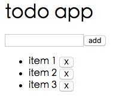

Vue是一个专注于前端UI的框架。它的主要能力是：

1. 声明式绑定。包括数据绑定、事件绑定
2. 基于组件的编程。让开发者可以把整个应用分为若干组件，分而治之

本篇文字会讲解声明式绑定，并且会谈及Vue的引入、数据绑定、事件绑定、Vue实例、指令。特别的，同样的案例，我也用来讲解Vue最为引以为傲的组件技术。案例是一个微小的叫做counter的应用，看起来是这样的：

有一个标签显示数字0，当点击按钮“+”，数字会每次加1。

我们会一个案例多种写法，包括Vue实例方案、组件方案。

##Vue实例

代码如下。你可以直接保存代码到html文件中，然后用浏览器打开，如果是IE的话必须是IE8或者或以上版本：

    
    

        {{count}}
        <button @click="inc">+</button>
    

    
    
你可以实际的操作，看到按钮和数字的互动变化。然后我们来看Vue如何做到的。
首先，必须引入Vue.js库。我们使用

随后，我们在script内创建Vue实例，并绑定到div#todo-app上，并且把静态的li换成动态的。这里同时添加了一个Vue实例方法，放在methods属性内，方法名为rm，以备删除事件发生时调用：
    
    var app= new Vue({
      el:'#todo-app',
      data:{
        items:['item 1','item 2','item 3'],
        todo:''
      },
      methods:{
        rm:function(i){
          this.items.splice(i,1)
        }
      }
    })
    
在html内，使用指令v-for从Vue实例内加载数据：

       <ul>
          <li v-for="(item, index) in items">{{item}}
            <button @click="rm(index)">X</button></li>
        </ul>
        
指令v-for会把当前所在元素（li）循环items长度指定的次数，把li重复多次渲染出来。因为当前Vue实例内的items长度为3，所以循环三次，和最初的html模板显示的内容是一致的。v-for不但可以按照每次循环取得当前项目item，还可以同时取出当前循环索引值，因为button内删除事件需要使用当前索引，这里把它取出来备用。注意另外一个特别的指令@click，它是v-on:click的缩写，标识绑定事件到rm方法上，参数为index。执行后，点击按钮x，我们就可以删除一个todo条目。

同样的，通过v-model指令，把input绑定到this.todo，把事件add绑定到按钮`add`:

    <input type="text" placeholder='new todo' v-model='todo'/> <button @click="add">add</button> 

并对应加入方法：

    methods:{
        add:function(){
          if(this.todo){
            this.items.push(this.todo)
            this.todo =''
          }
        },
    }

一个可以显示、添加、删除的todo应用就这样完成了。

