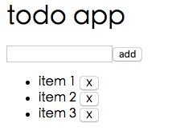

为了演示说明vue的组件通讯，我们从一个假设的todo应用开始（再次：）。UI当然还是类似这样的：

但是这次的新意在于，我们会把整个app分为三个组件，层次关系如下：

    app
    --newTodo
    --todoList

app作为父应用组件，newTodo作为一个子组件负责用户输入，并且获取新的todo，而todoList作为另外一个子组件则负责显示全部todo。

这样的分工在稍微大的app中非常常见，由此达成分而治之的目的。但是组件之间势必需要通讯，比如newTodo组件必须把新的todo字符串通知到todoList组件，以便后者更新todo列表并由此更新用户界面。

##基于组件结构的通讯

从子组件到父组件的通讯，vue.js提供了$dispatch方法，而从父组件到子组件则是通过 $broadcast方法。我们在如下的代码中使用了此技术：

    <html>
      <head>
        
      </head>
    <body>
      

          <h1>todo app</h1>
          <new-todo></new-todo>
          <todo-list></todo-list>
      

      
    </body>
    </html>
    
组件newTodo在用户点击按钮后会把新的todo字符串通过$dispatch发出，而父组件app在event内截获此事件，随即通过$broadcast方法发送到子组件，子组件todoList在event内截获此事件取出payload，加入它到数据items内。这就是组件通讯的方法。vue.js并没有提供兄弟组件直接的直接通讯方法，如果兄弟组件之间需要通讯，只能首先发给父组件，父组件想子组件广播，侦听此事件的子组件随后获取此事件。

通过$broadcast+$dispatch完成组件通讯是可行的，但是问题不少:

1. 依赖于树形组件结构，你得知道组件的结构是怎么样的
2. 组件结构复杂的话，必然降低通讯效率
3. 兄弟组件直接不能直接通讯，必须通过父组件间接完成

## 集中化的eventBus

实际上，我们只是为了让两个组件交换数据，这个过程并不应该和组件的结构（父子关系的组件，兄弟关系的组件）捆绑在一起。因此，一个变化的结构，是引入一个新的组件，此组件脱离组件关系，作为兄弟关系的组件之间的通讯中介。此技术被称为Event Bus。如下代码正式利用了此技术：

    <html>
      <head>
        
      </head>
    <body>
      

          <h1>todo app</h1>
          <new-todo></new-todo>
          <todo-list></todo-list>
      

      
    </body>
    </html>

由此代码我们可以看到：

1. app组件不再承担通讯中介功能，而只是简单的作为两个子组件的容器
2. EventBus组件承载了全部的数据（todos），以及对数据的修改，它监听事件add和delete，在监听函数内操作数据
3. 子组件todoList的data成员的数据来源改为从eventBus获取，删除todo的方法内不再操作数据，而是转发给eventBus来完成删除
4. 子组件newTodo的按钮不再添加数据，而是转发事件给eventBus，由后者完成添加

这样做就把本来捆绑到组件结构上的通讯还原为单纯的通讯，并且集中数据和操作到一个对象（eventBus）也就有利于组件的数据共享。

当我们谈到eventBus的时候，我们离vuex就比较进了。了解vuex可以看此文章：
https://segmentfault.com/a/1190000007516967

#ref
Learn Vuex by Building a Notes App
Build a Simple Todo App with Vue.js and Vuex 2.0
简单能用，但是没有体现出父子组件通讯的替代性。 https://github.com/wilf312/vuejs-vuex-todo-demo
Vue components communication http://stackoverflow.com/questions/34509103/vue-components-communication
关于父子通讯，这里写的很好：https://vuejs.org/v2/guide/migration.html#dispatch-and-broadcast-replaced

作者：刘传君

创建过产品，创过业。好读书，求甚解。
可以通过 1000copy#gmail.com 联系到我

## 出品
bootstrap小书 https://www.gitbook.com/book/1000copy/bootstrap/details
http小书 http://www.ituring.com.cn/book/1791
Git小书  http://www.ituring.com.cn/book/1870

